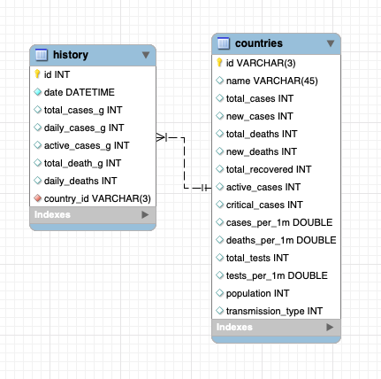

# Data Mining Project - Coronavirus Cases Web Scraper
This python code uses the Coronavirus website https://www.worldometers.info/coronavirus/ to fetch data about the virus. The data is both globally and individually for each country , and its history, of coronavirus cases. The code fetchs the data when running it first, and updates it every x time.

## Team Members
[Eran Perelman](https://github.com/EranPer/ "Eran Perelman's GitHub")<br/>
[Nofar Herman](https://github.com/nofr "Nofar Herman's GitHub")<br/>

## Process explanation

### Checkpoint 1
- We used requests, beautifulsoup and lxml platforms for creating functions of data parsing. The data is stored in lists, sets and dictionaries. The parsing code runs in a loop that updates the data every interval of time. The user can change the update times by changing it in the constant list in the config file.

### Checkpoint 2
- Command line interface - added web scraper options to be able to call it with different arguments from the terminal. Now you can use update times and countries arguments: 1st argument is a file containing update times to update data (every line in the format 00:00:00) and 2nd file containing countries, in every line. The code will fetch only relevant country's history, mentioned in the ```countries``` file, and will update it any given time, mentioned in the ```update_times``` file.

- Added a Mysql database to the program and its ERD. Now you can create a DB, insert and update the data that being fetched by the webscraper main code.

### Checkpoint 3
- Added logging to file and to screen.

- Now the coronavirus code is in OOP.

- Added a main code which creates a coronavirus object from a Coronavirus class. The main code handles all the connections between the web scraping and the database code.

- Added a PyMySql database code.

## Installation
You should install python with basic installations, such as DateTime, and all the prerequisites in the requirements.txt file.
```bash
pip install -r requirements.txt
```

## How to use the code
The program fetches the data at first and update it in any given time.
After installation, upload the python file to your favorite Python editor and run the code. 
Alternatively, run the code from the CLI (i.e. CMD in windows). The usage is the following:
```bash
Usage: coronavirus_2.1.py update_times.txt countries.txt
```
The default values, when running the code without arguments, will result in fetching all of the countries.

## DB documentation


The database includes 2 tables: country coronavirus cases and the history of cases for each country.

- countries table includes 14 columns: country id code (primary key), name of country, total coronavirus cases, new coronavirus cases, total deaths, new deaths, total recovered, active cases, critical cases, cases per 1 million, deaths per 1 million, total tests, tests per 1 million and population number.

- history table includes 8 columns: id (primary key), date by day, total cases, daily new cases, active cases, total deaths, daily deaths and country id (foreign key).

## DISCLAIMER
We use this information of the Coronavirus cases from the worldometers website for learning purposes only!
<br />All rights reserved ©
<br /><br />[Click for more details](https://www.shorturl.at/bqACD "The motivation")
